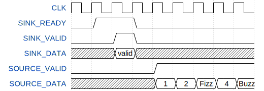

# FIZZ_BUZZ

The solution of Fizz Buzz programing problem in VHDL.

## Interface

| Name                 | I/O  | P/N  | Description                                         |
| -------------------- | ---- | ---- | --------------------------------------------------- |
| RESET_n              | I    | N    | Reset                                               |
| CLK                  | I    | P    | Clock                                               |
| SINK_READY           | O    | P    | Sink data ready                                     |
| SINK_VALID           | I    | P    | Sink data valid                                     |
| SINK_DATA[31:0]      | I    | P    | Sink data: Max Fizz Buzz count                      |
| SOURCE_VALID         | O    | P    | Source data valid                                   |
| SOURCE_DATA[31:0]    | O    | P    | Source data: Fizz Buzz count                        |
| SOURCE_FIZZBUZZ[2:0] | O    | P    | Source Fizz Buzz selector(2:FizzBuzz,1:Buzz,0:Fizz) |



<!-- 
{signal:[
{name:'CLK',wave:'p........'},
{name:'SINK_READY',wave:'01.0.....'},
{name:'SINK_VALID',wave:'0.10.....'},
{name:'SINK_DATA',wave:'x.=x.....',data:["valid"]},
{name:'SOURCE_VALID',wave:'0...1....'},
{name:'SOURCE_DATA',wave:'x...=====',data:["1","2","Fizz","4","Buzz"]},
]
}
 -->

`SOURCE_DATA` doesn't output "Fizz" or "Buzz" like the figure. `SOURCE_DATA` just outputs the count, and the output of "Fizz" or "Buzz" is selected by `SOURCE_FIZZBUZZ`.

## Principle

Whether the count is a multiple of 3 or 5 means that the number multiplying the count by 1/3 or 1/5 is an integer.  1/3 represented by binary fixed point is repeating decimal `0x5555...`. If the decimal point part of the count multiplied by 1/3 is `F`, the count is a multiple of 3.

```text
       1E(0d30)
*) 0.5555(0d0.333)
---------
   9.FFF6
```

## Project operation

### Build Quartus project

Make project and add VHDL source file.

```bash
$quartus_sh.exe --tcl_eval project_new FIZZ_BUZZ
$echo "set_global_assignment -name VHDL_FILE pld/FIZZ_BUZZ.vhd" >> FIZZ_BUZZ.qsf
```

Compile project

```bash
$make
quartus_sh.exe --flow compile FIZZ_BUZZ
```

### Run ModelSim simulation

```bash
$make check
```

ModelSim simulation runs, console output "FizzBuzz" in command shell.

```bash
# 1
# 2
# Fizz
# 4
# Buzz
```

If you rewrite the following statement in Makefile, GUI simulation runs.

**Makefile**(l.40)

```diff
-- 	vsim.exe -c $(MODELSIM_SIM_FLAGS) -msgmode both -displaymsgmode both TB_$(PROJECT) $(MODELSIM_DO_FLAGS)
++ 	vsim.exe $(MODELSIM_SIM_FLAGS) -msgmode both -displaymsgmode both TB_$(PROJECT) $(MODELSIM_DO_FLAGS)
```

## Operating environment

- Quartus Prime 18.0.0 Build 614 04/24/2018 SJ Lite Edition
- ModelSim - Intel FPGA Starter Edition 10.5b 2016.10
- Altera Nios2 Command Shell 18.0 Build 614 or
  Windows Subsystem for Linux(WSL) Ubuntu 16.04.6 LTS

## License

MIT License

## Author

[toms74209200](<https://github.com/toms74209200>)

